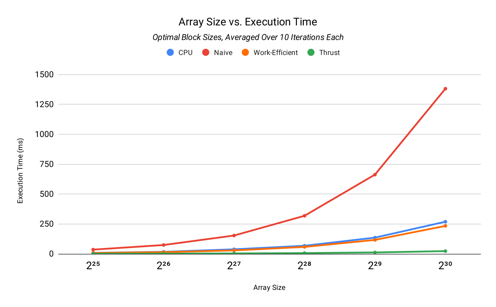
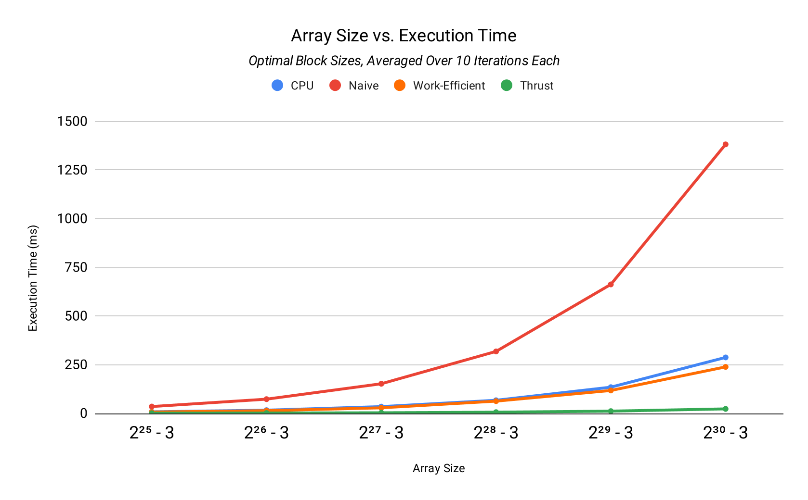
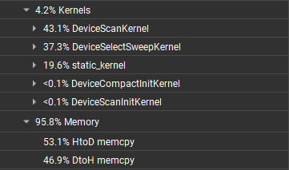
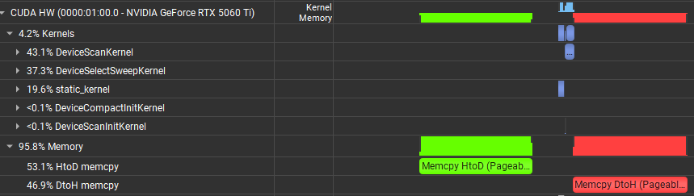

**University of Pennsylvania, CIS 5650: GPU Programming and Architecture, Project 2**

* Charles Wang
  * [LinkedIn](https://linkedin.com/in/zwcharl)
  * [Personal website](https://charleszw.com)
* Tested on:
  * Windows 11 Pro (26100.4946)
  * Ryzen 5 7600X @ 4.7Ghz
  * 32 GB RAM
  * RTX 5060 Ti 16 GB (Studio Driver 580.97)

# CUDA Stream Compaction

This project implements multiple commonly used GPU algorithms, which are reduction, computing prefix sums (scan), and stream compaction. Stream compaction uses the scan algorithm under the hood, and one of my implementations for finding prefix sums uses a parallel reduction, so these algorithms are all building on each other.

The purpose of this project was to understand these algorithms in more detail, and explore how their implementations change when we parallelize them on the GPU. It also taught me more about how CUDA works and how my kernels interact with the physical NVIDIA hardware.

## Implementations

In order to explore potential performance differences when scaling the input size, this project includes three different versions of the scan and compaction algorithms.

### CPU (single threaded)

*Found in [`cpu.cu`](stream_compaction/cpu.cu).*

These implementations run entirely on the CPU and are written in pure C++. They are single threaded by nature and are extremely simple. Given the input array, we iterate through each element to process it.

- For the scan, we keep a variable that stores the current sum of all previous elements. We then add the current element and set that as the output.
- The stream compaction algorithm was implemented both with and without using scan.
  - Without scan: maintain a separate index that we use to write to the output array, because it is (likely) to be less than the input array size.
  - With scan: map the input array elements to $1$ if it's considered valid, and $0$ otherwise. We then run an exclusive scan on this mapping array. This tells us which output array index to write to for each valid element.

### Naive GPU algorithms

*Found in [`naive.cu`](stream_compaction/naive.cu).*

This scan algorithm uses the GPU and is based on the naive algorithm described in [GPU Gems 3, Chapter 39.2.1](https://developer.nvidia.com/gpugems/gpugems3/part-vi-gpu-computing/chapter-39-parallel-prefix-sum-scan-cuda). Essentially, we process the array in-place across multiple iterations.

<div align="center">
  
  <p><i>Source: GPU Gems 3, Chapter 39.2.1</i></p>
</div>

As the figure above demonstrates, each iteration has us add pairs of numbers together and store it in the larger index of the two. Each addition operation is parallelized and performed in a separate thread.

Some more notes:

- The stride is calculated via $2^{i-1}$, where $i$ is the iteration and $1 \leq i \leq \text{ceil}(\lg(N))$. $N$ is the array size. Instead of using `pow(2, i - 1)`, I calculated it via bitshifts: `int stride = 1 << iteration - 1`.
- The number of blocks in my kernel dispatch depends on the number of operations needed for the current iteration.
- We need to maintain a separate read and write buffer to avoid potential race conditions. This increases memory usage and potentially affects performance.

### Work-efficient parallel scan

*Found in [`efficient.cu`](stream_compaction/efficient.cu).*

Implementations of the scan and compaction algorithms which theoretically require less operations and therefore should run more efficiently.

<div align="center">
  
  
  <p><i>Source: GPU Gems 3, Chapter 39.2.2</i></p>
</div>

It is based on the work-efficient parallel scan algorithm described in [GPU Gems 3, Chapter 39.2.2](https://developer.nvidia.com/gpugems/gpugems3/part-vi-gpu-computing/chapter-39-parallel-prefix-sum-scan-cuda), and involves an "up-sweep" where we build up a balanced binary tree, and then a "down-sweep" where we calculate final terms using the node elements in the tree.

## Performance benchmarks

### Methodology

First, I found the optimal block sizes for the naive and efficient CUDA kernels. This was mostly trial and error; I ended up using 64 for naive and 512 for efficient.

I then added additional code that would run each `scan()` algorithm a certain number of iterations, and average each of the execution times. For instance, this is what the output looks like for a benchmark where I'm running 10 iterations for each algorithm, on an array size of $2^{30}$:

```
********************
** SCAN BENCHMARK **
********************

- Number of iterations: 10
- Size of POT array: 1073741824
- Size of NPOT array: 1073741821

[CPU/POT] Average scan() time: 268.988
[CPU/NPOT] Average scan() time: 287.848
[Naive/POT] Average scan() time: 1381.91
[Naive/NPOT] Average scan() time: 1382.35
[Efficient/POT] Average scan() time: 233.941
[Efficient/NPOT] Average scan() time: 239.228
[Thrust/POT] Average scan() time: 23.0701
[Thrust/NPOT] Executing scan(): 6 of 10...
```

The `runBenchmarks` global variable in [`main.cpp`](src/main.cpp) controls this. I've also made available the raw data in the [`analysis`](analysis/) folder. Rows are CPU, naive, work-efficient, and thrust top to bottom. Columns are increasing array sizes left to right.

### Graphs

These are my graphs. The left column has array sizes that are powers of two (POT), while the right column subtract 3 from the sizes, therefore making them not powers of two (NPOT).

|Powers of two|Not powers of two|
|:-:|:-:|
|||

### Analysis

Given that we're working with increasing powers of two here, the exponential curve makes sense. While the naive algorithm is able to stay competitive at smaller array sizes, it is essentially doubles in execution time every time we double the array size. The additional $\log n$ factor is really causing this algorithm to suffer, and deems it highly inefficient for large inputs.

The CPU and work-efficient algorithm are much closer in execution time, and this can again be explained by their theoretical runtime. As previously explained, the CPU algorithm iterates over each element sequentially, netting us a $O(n)$ runtime. The work-efficient GPU algorithm manages to execute its operations using $O(n)$ operations as well. I believe this explains why they performed essentially the same (although I definitely missed some of the hardware and indexing optimizations to truly make the GPU algorithm faster).

### Thrust

To briefly analyze Thrust, I executed the test program with just the Thrust implementations of exclusive scan and compaction. I then profiled the program with Nsight Systems. Here is a screenshot of the overall CUDA utilization:

<div align="center">
  
</div>

If I'm not mistaken, this is telling me that over 95% of the time the GPU hardware was simply dealing with memory-related operations. If we zoom in more closely on the timeline, we can confirm this:

<div align="center">
  
</div>

Here we can see that most of the time was spent on host-to-device and device-to-host memory operations. Meanwhile, the small blue rectangles between the larger green and red blocks indicate the *actual* time spent in the CUDA kernels.

This tells me that the Thrust implementations of these algorithms are so highly optimized and efficient that it's not the algorithm that's causing the bottleneck, it's memory bandwidth speeds between the GPU and the rest of the system!

### Miscellaneous: powers of scale

Just wanted to share some other fun stuff I encountered while testing.

I originally was testing with *much* smaller array sizes, like $2^4$ and $2^{12}$. When I tried increasing the array size past $2^{18}$, the program would instantly crash. I was really confused why at first, until I looked at the exception being thrown: *stack overflow*. Because I was using `std::array` for my input and output arrays, I was allocating too much stack memory and literally ran out. Switching to heap allocation solved the issue.

I then tried testing with array sizes from $2^{18}$ to $2^{30}$, incrementing by 4. This turned out to not be helpful at all; my numbers ranged from 0.068ms using CPU and $2^{18}$ to 1380.23ms using naive and $2^{30}$. Furthermore, my naive at $2^{26}$ ran in 75ms, so there was a ~18× difference between two adjacent data points. This would have translated to a *horrible* graph, so I adjusted the numbers to what I have now. 

Both of these experiences really left me with a newfound appreciation for exponents and the powers of two. It's *scary* how fast numbers can scale.

## Test output

This is the complete output for my tests. I used an array size of $2^{16}$ here.

```
****************
** SCAN TESTS **
****************
    [  29  10  21  39  47  19  41  42   5  25  49  34   4 ...  32   0 ]
==== cpu scan, power-of-two ====
   elapsed time: 0.0168ms    (std::chrono Measured)
==== cpu scan, non-power-of-two ====
   elapsed time: 0.0162ms    (std::chrono Measured)
    passed
==== naive scan, power-of-two ====
   elapsed time: 0.246016ms    (CUDA Measured)
    passed
==== naive scan, non-power-of-two ====
   elapsed time: 0.313984ms    (CUDA Measured)
    passed
==== work-efficient scan, power-of-two ====
   elapsed time: 0.806944ms    (CUDA Measured)
    passed
==== work-efficient scan, non-power-of-two ====
   elapsed time: 0.3496ms    (CUDA Measured)
    passed
==== thrust scan, power-of-two ====
   elapsed time: 0.088352ms    (CUDA Measured)
    passed
==== thrust scan, non-power-of-two ====
   elapsed time: 0.09392ms    (CUDA Measured)
    passed

*****************************
** STREAM COMPACTION TESTS **
*****************************
    [   3   2   1   3   3   1   1   0   1   3   1   2   0 ...   0   0 ]
==== cpu compact without scan, power-of-two ====
   elapsed time: 0.1223ms    (std::chrono Measured)
    passed
==== cpu compact without scan, non-power-of-two ====
   elapsed time: 0.0794ms    (std::chrono Measured)
    passed
==== cpu compact with scan, power-of-two ====
   elapsed time: 0.116ms    (std::chrono Measured)
    passed
==== cpu compact with scan, non-power-of-two ====
   elapsed time: 0.1174ms    (std::chrono Measured)
    passed
==== work-efficient compact, power-of-two ====
   elapsed time: 0.771552ms    (CUDA Measured)
    passed
==== work-efficient compact, non-power-of-two ====
   elapsed time: 0.634944ms    (CUDA Measured)
    passed
==== thrust compact, power-of-two ====
   elapsed time: 0.136608ms    (CUDA Measured)
    passed
==== thrust compact, non-power-of-two ====
   elapsed time: 0.241568ms    (CUDA Measured)
    passed
```